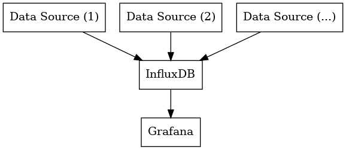

Collect time series data from various sources, store them in InfluxDB, and visualize them with Grafana.

We include a data source (`ds-price/`) collecting electricity price data from [Nord Pool's](https://www.nordpoolgroup.com/en/) market data API.

## How Setup Works
InfluxDB automatically bootstraps the system if `DOCKER_INFLUXDB_INIT_MODE` is set to `setup` and `/var/lib/influxdb2` is empty (no boltdb file found, where boltdb is the storage engine).
All other env variables listed in `influxdb.env` `DOCKER_INFLUXDB_INIT_*` have to be set for InfluxDB to complete the setup.
If InfluxDB finds scripts located in `/docker-entrypoint-initdb.d` it executes these in lexicographical order.

## Grafana dashboards
The json description files for the grafana dashboards can be found under `grafana/dashboards`.
The contents of this directory are pulled by grafana every 30 seconds (this can be configured under `grafana/provisioning/dashboards/dashboard-provider.yml`)
and the dashboards are updated accordingly.

## Dependencies
- docker
- docker-compose

## Usage
1. Run `$ docker-compose up -d`

### Influxdb web interface
1. Visit localhost:8086 in webbrowser for the influxdb web interface
1. Login with username "admin" and password "admin_password" (identical to `DOCKER_INFLUXDB_INIT_USERNAME` / `DOCKER_INFLUXDB_INIT_PASSWORD` in `influxdb.env`)

### Grafana web interface
1. Visit localhost:3000 in webbrowser for the grafana web interface

